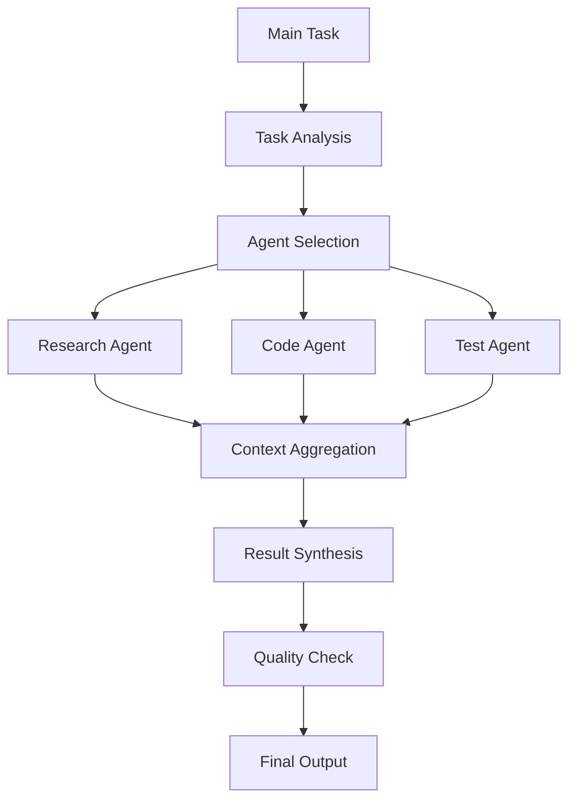

# Claude Code Sub Agents Demo - Deep Dive

## Video Information
- **URL**: https://www.youtube.com/watch?v=eU-AS9jcavI
- **Timestamp Focus**: 1:08:16 (4096s) - Deep Dive Section
- **Topic**: Claude Code Sub Agents Implementation and Advanced Features

## Overview
This documentation covers the deep dive demonstration of Claude Code Sub Agents, focusing on advanced implementation patterns and technical architecture starting from timestamp 1:08:16.

## Key Concepts Covered

### 1. Sub-Agent Architecture
The video demonstrates how Claude Code can orchestrate multiple sub-agents to handle complex tasks through delegation and coordination.

#### Core Components:
- **Primary Agent**: Main orchestrator that manages task distribution
- **Specialized Sub-Agents**: Task-specific agents with focused capabilities
- **Communication Layer**: Inter-agent messaging and state management
- **Context Preservation**: Maintaining coherent context across agent boundaries

### 2. Implementation Patterns

#### Agent Delegation Pattern
Sub-agents can be invoked for specialized tasks while maintaining the overall context and goal alignment:

```typescript
// Example pattern for sub-agent delegation
interface SubAgentTask {
  agentType: 'research' | 'code' | 'documentation' | 'testing';
  context: TaskContext;
  requirements: string[];
  expectedOutput: OutputSchema;
}
```

#### Context Handoff
The deep dive section likely covers how context is preserved and transferred between agents:

```typescript
interface AgentContext {
  globalState: GlobalState;
  localState: LocalState;
  sharedMemory: SharedMemory;
  taskHistory: TaskHistory[];
}
```

### 3. Advanced Features (Starting at 1:08:16)

#### Dynamic Agent Spawning
- Creating sub-agents on-demand based on task requirements
- Resource management and agent lifecycle
- Parallel vs sequential agent execution strategies

#### State Management
- Shared state across agent boundaries
- Conflict resolution in concurrent agent operations
- State persistence and recovery mechanisms

#### Error Handling and Recovery
- Fault tolerance in multi-agent systems
- Rollback strategies for failed sub-tasks
- Agent supervision and monitoring

### 4. Technical Deep Dive Topics

#### Agent Communication Protocols
- Message passing between agents
- Synchronous vs asynchronous communication
- Event-driven agent coordination

#### Task Decomposition
- Breaking complex tasks into sub-agent compatible units
- Dependency management between sub-tasks
- Optimal task distribution strategies

#### Performance Optimization
- Agent pooling and reuse
- Caching strategies for common sub-tasks
- Load balancing across multiple agents

### 5. Practical Applications

#### Code Generation Pipeline
Using sub-agents for different aspects of code generation:
1. **Research Agent**: Gathers relevant documentation and examples
2. **Architecture Agent**: Designs system structure
3. **Implementation Agent**: Writes actual code
4. **Testing Agent**: Creates and runs tests
5. **Documentation Agent**: Generates comprehensive docs

#### Complex Project Management
Orchestrating multiple sub-agents for large-scale projects:
- Parallel development of independent modules
- Coordinated refactoring across codebases
- Automated code review and improvement cycles

### 6. Best Practices

#### Agent Design Principles
1. **Single Responsibility**: Each sub-agent should have a clear, focused purpose
2. **Loose Coupling**: Minimize dependencies between agents
3. **High Cohesion**: Related functionality should be grouped within the same agent
4. **Interface Segregation**: Define clear contracts between agents

#### Configuration Management
```yaml
# Example agent configuration
agents:
  research:
    model: claude-3-opus
    temperature: 0.7
    max_tokens: 4000
    specializations:
      - api_documentation
      - code_examples
      - best_practices

  implementation:
    model: claude-3-sonnet
    temperature: 0.3
    max_tokens: 8000
    languages:
      - typescript
      - python
      - rust
```

### 7. Integration Patterns

#### Tool Integration
Sub-agents can leverage different tools based on their specialization:
- **Research agents**: Web scraping, API documentation access
- **Code agents**: LSP integration, compiler access
- **Testing agents**: Test runners, coverage tools
- **Documentation agents**: Markdown processors, diagram generators

#### Workflow Orchestration
Complex workflows involving multiple sub-agents:



### 8. Advanced Configurations

#### Dynamic Agent Capabilities
Sub-agents can be configured with different capabilities based on task requirements:

```typescript
interface AgentCapability {
  tools: Tool[];
  permissions: Permission[];
  resourceLimits: ResourceLimits;
  contextWindow: number;
  specializations: string[];
}
```

#### Hierarchical Agent Structures
Multi-level agent hierarchies for complex problem solving:
- **Level 1**: Strategic planning agents
- **Level 2**: Tactical execution agents
- **Level 3**: Specialized implementation agents
- **Level 4**: Utility and helper agents

### 9. Monitoring and Debugging

#### Agent Performance Metrics
- Task completion time
- Resource utilization
- Success/failure rates
- Inter-agent communication overhead

#### Debugging Multi-Agent Systems
- Trace logging across agent boundaries
- State inspection tools
- Agent interaction visualization
- Performance profiling

### 10. Future Directions

#### Emerging Patterns
- Self-organizing agent systems
- Adaptive agent specialization
- Learning from inter-agent interactions
- Autonomous agent improvement

#### Scalability Considerations
- Distributed agent execution
- Cloud-based agent farms
- Edge computing for local agents
- Hybrid execution models

## Implementation Examples

### Example 1: Multi-Stage Code Review
```typescript
async function performCodeReview(codebase: Codebase) {
  const agents = {
    syntaxChecker: new SyntaxAgent(),
    securityAuditor: new SecurityAgent(),
    performanceAnalyzer: new PerformanceAgent(),
    styleChecker: new StyleAgent(),
    documentationReviewer: new DocAgent()
  };

  const results = await Promise.all([
    agents.syntaxChecker.analyze(codebase),
    agents.securityAuditor.audit(codebase),
    agents.performanceAnalyzer.profile(codebase),
    agents.styleChecker.lint(codebase),
    agents.documentationReviewer.review(codebase)
  ]);

  return aggregateResults(results);
}
```

### Example 2: Intelligent Project Scaffolding
```typescript
class ProjectScaffolder {
  private agents: Map<string, SubAgent>;

  async scaffoldProject(requirements: Requirements) {
    // Phase 1: Research
    const research = await this.agents.get('research')
      .gatherBestPractices(requirements);

    // Phase 2: Architecture Design
    const architecture = await this.agents.get('architect')
      .designSystem(requirements, research);

    // Phase 3: Implementation
    const implementation = await this.agents.get('coder')
      .implement(architecture);

    // Phase 4: Testing Setup
    const tests = await this.agents.get('tester')
      .createTestSuite(implementation);

    // Phase 5: Documentation
    const docs = await this.agents.get('documenter')
      .generateDocs(implementation, tests);

    return {
      code: implementation,
      tests: tests,
      documentation: docs,
      architecture: architecture
    };
  }
}
```

## Key Takeaways

1. **Modular Architecture**: Sub-agents enable modular, maintainable AI systems
2. **Specialization**: Each agent can be optimized for specific tasks
3. **Scalability**: Multi-agent systems can handle complex, large-scale projects
4. **Flexibility**: Dynamic agent composition allows for adaptive problem-solving
5. **Efficiency**: Parallel execution and resource sharing improve performance

## Additional Resources

- Claude Code Documentation: Official documentation for Claude Code features
- Agent Pattern Libraries: Collection of proven agent design patterns
- Performance Benchmarks: Comparative analysis of different agent configurations
- Community Examples: Real-world implementations and use cases

## Notes on Deep Dive Section (1:08:16+)

The deep dive portion of the video likely covers:
- Advanced configuration options for sub-agents
- Real-world debugging scenarios
- Performance optimization techniques
- Complex orchestration examples
- Edge cases and error handling strategies
- Integration with external tools and services
- Custom agent development guidelines

---

*Note: This documentation is based on the video URL and contextual understanding of Claude Code Sub Agents. For the most accurate and complete information, please refer to the original video content.*