# Architecture Diagram Guide

## Diagram Selection

| Question | Diagram Type |
|----------|-------------|
| What systems exist and who uses them? | C4 Context |
| What are the major technical building blocks? | C4 Container |
| What's inside a specific container? | C4 Component |
| How do components interact for a specific flow? | Sequence |
| Where does everything run? | Deployment |
| How does data flow through the system? | Data flow |
| What happens when things go wrong? | Failure mode |

---

## C4 Model Diagrams (Mermaid)

### Level 1: System Context

Shows the system as a box, surrounded by users and other systems it interacts with.

```mermaid
graph TB
    User["👤 User<br/><i>Uses the application</i>"]
    Admin["👤 Admin<br/><i>Manages configuration</i>"]

    System["🏢 System Name<br/><i>Does the core thing</i>"]

    ExtPayment["🏦 Payment Provider<br/><i>Processes payments</i>"]
    ExtEmail["📧 Email Service<br/><i>Sends notifications</i>"]

    User -->|"Uses (HTTPS)"| System
    Admin -->|"Configures (HTTPS)"| System
    System -->|"Charges cards"| ExtPayment
    System -->|"Sends emails"| ExtEmail

    style System fill:#438DD5,color:#fff
    style ExtPayment fill:#999,color:#fff
    style ExtEmail fill:#999,color:#fff
```

### Level 2: Container

Shows the major technical building blocks (applications, databases, queues, etc.).

```mermaid
graph TB
    User["👤 User"]

    subgraph System["System Boundary"]
        WebApp["🌐 Web App<br/><i>React SPA</i>"]
        API["⚙️ API Server<br/><i>Node.js / Express</i>"]
        Worker["⏱️ Background Worker<br/><i>Job processing</i>"]
        DB[("🗄️ Database<br/><i>PostgreSQL</i>")]
        Cache[("⚡ Cache<br/><i>Redis</i>")]
        Queue["📬 Message Queue<br/><i>RabbitMQ</i>"]
    end

    User -->|"HTTPS"| WebApp
    WebApp -->|"JSON/HTTPS"| API
    API -->|"SQL"| DB
    API -->|"Read/Write"| Cache
    API -->|"Publishes"| Queue
    Worker -->|"Consumes"| Queue
    Worker -->|"SQL"| DB

    style WebApp fill:#438DD5,color:#fff
    style API fill:#438DD5,color:#fff
    style Worker fill:#438DD5,color:#fff
    style DB fill:#B58900,color:#fff
    style Cache fill:#B58900,color:#fff
    style Queue fill:#D33682,color:#fff
```

### Level 3: Component

Shows internals of a single container.

```mermaid
graph TB
    subgraph API["API Server"]
        Router["🔀 Router<br/><i>Express routes</i>"]
        AuthMiddleware["🔒 Auth Middleware<br/><i>JWT validation</i>"]
        UserController["👤 User Controller"]
        OrderController["📦 Order Controller"]
        UserService["User Service<br/><i>Business logic</i>"]
        OrderService["Order Service<br/><i>Business logic</i>"]
        UserRepo["User Repository<br/><i>Data access</i>"]
        OrderRepo["Order Repository<br/><i>Data access</i>"]
    end

    Router --> AuthMiddleware
    AuthMiddleware --> UserController
    AuthMiddleware --> OrderController
    UserController --> UserService
    OrderController --> OrderService
    UserService --> UserRepo
    OrderService --> OrderRepo
    OrderService --> UserService

    DB[("Database")]
    UserRepo --> DB
    OrderRepo --> DB

    style Router fill:#438DD5,color:#fff
    style AuthMiddleware fill:#859900,color:#fff
    style UserService fill:#6C71C4,color:#fff
    style OrderService fill:#6C71C4,color:#fff
```

---

## Sequence Diagrams

Use for illustrating specific flows, especially across service boundaries.

---

## Deployment Diagrams

```mermaid
graph TB
    subgraph Cloud["Cloud Provider (AWS/GCP/Azure)"]
        subgraph Region1["Region: us-east-1"]
            subgraph K8s["Kubernetes Cluster"]
                subgraph NS1["Namespace: production"]
                    API1["API Pod x3"]
                    Worker1["Worker Pod x2"]
                end
            end
            DB1[("RDS Primary")]
            Cache1[("ElastiCache")]
            Queue1["SQS / RabbitMQ"]
        end

        subgraph Region2["Region: eu-west-1"]
            subgraph K8s2["Kubernetes Cluster"]
                API2["API Pod x2"]
            end
            DB2[("RDS Replica")]
        end

        CDN["CloudFront / CDN"]
        S3["S3 Static Assets"]
    end

    User["👤 Users"] --> CDN
    CDN --> S3
    CDN --> API1
    CDN --> API2
    API1 --> DB1
    API1 --> Cache1
    API1 --> Queue1
    Worker1 --> Queue1
    Worker1 --> DB1
    DB1 -.->|"Replication"| DB2
    API2 --> DB2
```

---

## Data Flow Diagrams

---

## Tips for Good Diagrams

1. **One diagram, one purpose** — Don't cram everything into a single diagram
2. **Label relationships** — Arrows without labels are ambiguous
3. **Use consistent notation** — Pick a style and stick with it
4. **Show what matters** — Omit details that don't serve the diagram's purpose
5. **Add a legend** — If using colors or shapes meaningfully, explain them
6. **Name things clearly** — Use business terms for context diagrams, tech terms for container/component
7. **Keep it maintainable** — Diagrams-as-code (Mermaid) > image files