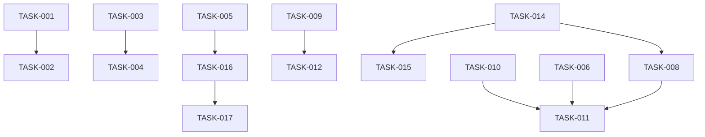

# Agent Teams Configuration and Workflow

## Status: Planning

## Overview

Claude Code agent teams are enabled in `.claude/settings.json` via `CLAUDE_CODE_EXPERIMENTAL_AGENT_TEAMS=1` but no supporting infrastructure exists. The current agent definitions (`architect`, `memory-manager`, `data-integrity`) were built as subagents — not designed for multi-agent team collaboration. This story covers the configuration, agent design, quality gates, and workflow patterns needed to make teams effective within the aiconfig system.

Reference: [Claude Code Agent Teams Docs](https://code.claude.com/docs/en/agent-teams)

## User Stories

- As a developer, I want to spin up a team for feature work so that research, implementation, and testing happen in parallel
- As a developer, I want quality gates on teammate output so that tasks aren't marked complete until they actually pass checks
- As a developer, I want teammates to use the aiconfig memory system so that team work is captured in session logs and decisions
- As a developer, I want pre-built team compositions for common workflows so I don't have to describe the team structure every time

---

## Phase Tracking

| Phase | Status | Artifacts |
|-------|--------|-----------|
| Discovery | ✅ | This story |
| Plan | 🔄 | This story |
| Implement | ⏳ | TBD |
| Test | ⏳ | TBD |

---

## Context: How Agent Teams Work

### Architecture

| Component | Role |
|-----------|------|
| **Team lead** | Main Claude Code session. Creates team, spawns teammates, coordinates work |
| **Teammates** | Separate Claude Code instances with independent context windows |
| **Task list** | Shared work items at `~/.claude/tasks/{team-name}/` |
| **Mailbox** | Messaging system for inter-agent communication |
| **Team config** | `~/.claude/teams/{team-name}/config.json` |

### Key Constraints

- Teammates load CLAUDE.md, MCP servers, and skills — but NOT the lead's conversation history
- Teammates cannot spawn other teammates or teams (no nesting)
- One team per session. Clean up before starting another
- All teammates inherit the lead's permission mode at spawn time
- No session resumption for in-process teammates after `/resume`
- File conflicts are the biggest risk — two teammates editing the same file causes overwrites

### Display Modes

| Mode | Setting | Requirement |
|------|---------|-------------|
| `in-process` | Default — all in one terminal | Any terminal |
| `tmux` | Split panes per teammate | tmux or iTerm2 with `it2` CLI |
| `auto` | Uses tmux if already in a tmux session | tmux |

### Relevant Hooks

| Hook | When | Purpose |
|------|------|---------|
| `TeammateIdle` | Teammate about to go idle | Enforce quality gates before stopping |
| `TaskCompleted` | Task being marked complete | Validate work before allowing completion |
| `SubagentStart` | Teammate spawns | Inject context |
| `SubagentStop` | Teammate finishes | Log results |

---

## Tasks

### Phase 1: Settings and Display Configuration (High Priority)

- [ ] TASK-001: Configure `teammateMode` in `.claude/settings.json`
  - Add `"teammateMode": "in-process"` as default (works everywhere)
  - Document how to switch to `"tmux"` for split panes
  - Note: tmux has known limitations — iTerm2 with `it2` CLI is recommended on macOS

- [ ] TASK-002: Configure teammate permission pre-approval
  - Permission prompts from teammates bubble up to the lead, creating friction
  - Add common tool approvals to `.claude/settings.json` permissions to reduce interruptions
  - At minimum, pre-approve: `Read`, `Grep`, `Glob`, `Bash(npm test *)`, `Bash(git *)` for teammates

### Phase 2: Quality Gate Hooks (High Priority)

- [ ] TASK-003: Implement `TaskCompleted` hook
  - When a teammate marks a task complete, run validation before allowing it
  - Script should: check if tests pass (if applicable), verify no lint errors on modified files
  - Exit code 2 blocks completion and sends feedback to the teammate
  - Configure in `.claude/settings.json`:
    ```json
    {
      "hooks": {
        "TaskCompleted": [{
          "hooks": [{
            "type": "command",
            "command": "$CLAUDE_PROJECT_DIR/.claude/hooks/validate-task-completion.sh"
          }]
        }]
      }
    }
    ```

- [ ] TASK-004: Implement `TeammateIdle` hook
  - When a teammate is about to go idle, validate their work
  - Check: did they update any task status? Are in-progress tasks actually done?
  - Exit code 2 keeps them working with feedback
  - Keep lightweight — this fires frequently

- [ ] TASK-005: Implement session logging on teammate stop
  - Use `SubagentStop` hook to capture what each teammate accomplished
  - Extract `last_assistant_message` from hook input
  - Append a summary to the project's `sessions.json` via atomic-write scripts
  - Tags should include `team:{team-name}` and `teammate:{name}` for filtering

### Phase 3: Team-Aware Agents (Medium Priority)

The existing agents were designed as standalone subagents. They need updates to work effectively as teammates in a team context.

- [ ] TASK-006: Update `architect` agent for team use
  - Currently has `Write` tool — risks file conflicts when other teammates are implementing
  - Add a team-mode variant (or note in the agent) that restricts to read-only when used as a research teammate
  - Add `memory: project` to persist architectural findings across sessions
  - Preload the `architect` skill: add `skills: [architect]` to frontmatter

- [ ] TASK-007: Update `memory-manager` agent for team use
  - Must use data-integrity scripts (atomic-write, file-lock) when writing as a teammate
  - Risk: multiple teammates triggering memory writes simultaneously
  - Add `memory: project` for persistent memory
  - Consider making this a lead-only agent (teammates shouldn't write to shared memory independently)

- [ ] TASK-008: Create `implementer` agent for team use
  - Purpose: focused implementation teammate that owns a specific set of files
  - Tools: `Read, Write, Edit, Bash, Grep, Glob`
  - Preload relevant skills: coding standards
  - The spawn prompt from the lead should specify which files/modules this teammate owns
  - Add `isolation: worktree` option for parallel implementation without file conflicts

- [ ] TASK-009: Create `reviewer` agent for team use
  - Purpose: read-only code review teammate
  - Tools: `Read, Grep, Glob, Bash`
  - Disallowed tools: `Write, Edit`
  - Model: `sonnet` (fast, good at pattern matching)
  - Should produce structured review output (critical/warning/suggestion)
  - Preload: code review prompts from `context/prompts/code-review.md`

- [ ] TASK-010: Create `tester` agent for team use
  - Purpose: write and run tests for code produced by implementer teammates
  - Tools: `Read, Write, Edit, Bash, Grep, Glob`
  - Should wait for implementation tasks to complete (task dependency)
  - Uses testing standards from `context/coding-standards/testing.md`
  - `isolation: worktree` recommended to avoid test file conflicts

### Phase 4: Pre-Built Team Compositions (Medium Priority)

Create skills that spawn pre-configured team compositions for common workflows.

- [ ] TASK-011: Create `/team-feature` skill
  - Spawns a team for new feature development
  - Default composition: researcher (Explore), implementer, tester
  - Researcher investigates existing code and produces a plan
  - Implementer builds the feature (requires plan approval from lead)
  - Tester writes tests after implementation tasks complete
  - Use `disable-model-invocation: true` — user-triggered only
  - Accept `$ARGUMENTS` as the feature description

- [ ] TASK-012: Create `/team-review` skill
  - Spawns a team for parallel code review
  - Default composition: security reviewer, performance reviewer, test coverage reviewer
  - Each reviewer gets a distinct lens (no overlap)
  - Lead synthesizes findings into a single review
  - Accept `$ARGUMENTS` as the PR number or branch

- [ ] TASK-013: Create `/team-debug` skill
  - Spawns a team for investigating bugs with competing hypotheses
  - Default composition: 3 investigators, each assigned a different theory
  - Teammates should message each other to challenge findings
  - Lead converges on root cause
  - Accept `$ARGUMENTS` as the bug description or issue number

### Phase 5: Worktree Isolation Strategy (Medium Priority)

- [ ] TASK-014: Document worktree strategy for parallel implementation
  - When multiple teammates edit code, use `isolation: worktree` to give each a git worktree
  - Worktrees provide an isolated copy of the repo — no file conflicts
  - Worktrees are auto-cleaned if the teammate makes no changes
  - If changes are made, the worktree path and branch are returned
  - Lead is responsible for merging worktree branches back

- [ ] TASK-015: Create merge workflow for worktree results
  - After teammates finish in worktrees, lead needs to merge branches
  - Create a skill or hook that handles: list active worktree branches, merge sequentially, resolve conflicts
  - Consider a `PostToolUse` hook on `Task` to auto-merge when a worktree teammate completes

### Phase 6: Integration with Memory System (Low Priority)

- [ ] TASK-016: Auto-log team sessions to project memory
  - When a team is cleaned up, aggregate all teammate activity into a single session log
  - Include: team name, teammates involved, tasks completed, files modified per teammate, decisions made
  - Use the existing `sessions.json` schema with additional `team` field
  - Must use atomic-write with locking since this runs at cleanup time

- [ ] TASK-017: Record team decisions as ADRs
  - When teammates reach consensus on architectural decisions during team work, capture as ADRs
  - The lead should be prompted to record decisions at the end of team work
  - Could be automated via a `Stop` hook on the lead: "Did the team make any architectural decisions?"

---

## Dependencies



---

## Parallel Tracks

### Track A: Infrastructure (start immediately)
TASK-001 → TASK-002

### Track B: Quality Gates (start immediately)
TASK-003 → TASK-004 → TASK-005

### Track C: Agent Definitions (after Track A)
TASK-006, TASK-007, TASK-008, TASK-009, TASK-010 (parallel)

### Track D: Team Skills (after Track C)
TASK-011, TASK-012, TASK-013 (parallel)

### Track E: Worktree Strategy (after Track C)
TASK-014 → TASK-015

### Track F: Memory Integration (after Track B)
TASK-016 → TASK-017

---

## Acceptance Criteria

### Must Have
- [ ] `teammateMode` configured in settings
- [ ] `TaskCompleted` hook validates work before allowing completion
- [ ] `TeammateIdle` hook catches incomplete work
- [ ] Teammate activity logged to session memory on stop
- [ ] At least one pre-built team skill (`/team-feature`)

### Should Have
- [ ] Dedicated `implementer`, `reviewer`, `tester` agents
- [ ] Worktree isolation for parallel implementation
- [ ] Permission pre-approval to reduce teammate friction
- [ ] `/team-review` and `/team-debug` skills

### Nice to Have
- [ ] Auto-merge workflow for worktree branches
- [ ] ADR auto-capture from team decisions
- [ ] Aggregate team session logs on cleanup

---

## Technical Notes

### Key Decisions
- Teams are experimental (`CLAUDE_CODE_EXPERIMENTAL_AGENT_TEAMS=1`) — API may change
- `in-process` mode is the safe default; `tmux` requires extra setup
- File conflicts are the #1 risk — use worktree isolation for any parallel editing
- Quality gate hooks use `exit 2` to block + send feedback (not JSON decisions)
- Teammates inherit the lead's permissions — pre-approve common tools to reduce prompts
- The `memory-manager` agent should only write to memory when invoked by the lead, not autonomously by teammates

### Risks
- Token cost: each teammate is a separate Claude instance. Teams with 4+ members burn tokens fast
- Teammate coordination overhead: tasks that aren't clearly independent will cause conflicts
- No session resumption: if the lead crashes, in-process teammates are lost
- tmux split-pane mode doesn't work in VS Code integrated terminal, Windows Terminal, or Ghostty
- Hook scripts for quality gates must be fast — slow scripts block the entire team

### Open Questions
- What's the maximum useful team size before coordination overhead outweighs benefit?
- Should `/team-feature` auto-determine team composition based on the feature description?
- How do we handle the case where a worktree branch has merge conflicts with main?
- Should the `tester` agent run in a worktree to avoid conflicting with the `implementer`?
- Can we use `plan` permission mode for teammates to force plan-before-implement?
- Should teammate agents have `memory: project` by default for cross-session learning?

---

## Files to Create

```
# Quality gate hooks
.claude/hooks/validate-task-completion.sh
.claude/hooks/validate-teammate-idle.sh
.claude/hooks/log-teammate-stop.sh

# Team-oriented agents
.claude/agents/implementer.md
.claude/agents/reviewer.md
.claude/agents/tester.md

# Pre-built team skills
.claude/skills/team-feature/SKILL.md
.claude/skills/team-review/SKILL.md
.claude/skills/team-debug/SKILL.md
```

## Files to Modify

```
# Settings
.claude/settings.json (add teammateMode, hooks, permission pre-approvals)

# Existing agents
.claude/agents/architect-agent.md (add memory, skills preloading, team notes)
.claude/agents/memory-manager.md (restrict to lead-only, add data-integrity notes)

# Documentation
docs/howto/example.md (add teams section once implemented)
```

---

## Completion Log

| Date | Phase | Notes |
|------|-------|-------|
| 2026-02-22 | Discovery | Audited agent teams docs, existing agents, and settings |
| 2026-02-22 | Plan | Created 17 tasks across 6 phases |
