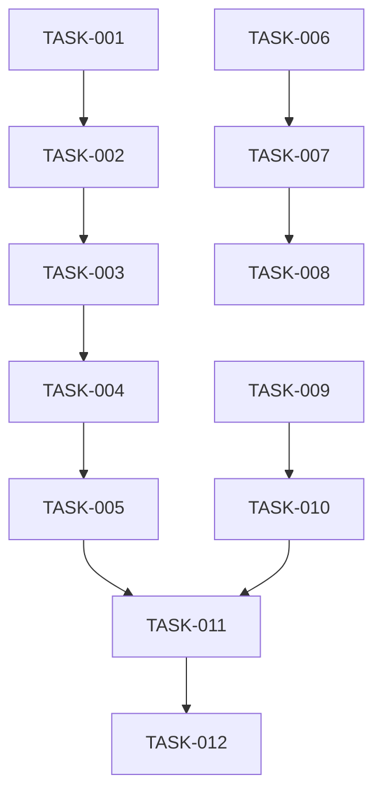

# Context Management System Improvements

## Status: Planning

## Overview
Address gaps between documented architecture and actual implementation in the AIConfig context management system. This story focuses on data integrity, synchronization robustness, and cross-client parity to fulfill the PRD vision of seamless context sharing.

## User Stories
- As a developer, I want my context to sync between Claude Code and Cursor so that I can switch tools without losing session history
- As a developer, I want conflict-free concurrent access so that parallel tool usage doesn't corrupt my memory files
- As a developer, I want consistent behavior across clients so that my workflows are portable

---

## Phase Tracking

| Phase | Status | Artifacts |
|-------|--------|-----------|
| Architect | ✅ | [architecture.md](../architecture.md) |
| Plan | 🔄 | This story |
| Implement | ⏳ | TBD |
| Test | ⏳ | TBD |
| Review | ⏳ | TBD |

---

## Tasks

### Phase 1: Data Integrity (High Priority)
- [x] TASK-001: Add JSON schema validation for memory files (sessions.json, decisions.json, context.json)
- [x] TASK-002: Implement atomic file writes with temp files and rename to prevent corruption

### Phase 2: Synchronization & Conflict Handling (High Priority)
- [x] TASK-003: Implement file locking mechanism for concurrent client access
- [x] TASK-004: Add version vectors for conflict detection between Claude Code and Cursor
- [x] TASK-005: Create merge strategies for common conflict scenarios (append for sessions, manual for decisions)

### Phase 3: Cross-Client Parity (Medium Priority)
- [x] TASK-006: Populate `.cursor/rules/` with actual rule files matching Claude Code capabilities
- [x] TASK-007: Create hook abstraction layer to normalize event differences between clients (Cursor has native support)
- [ ] TASK-008: Unify environment variable handling (`AICONFIG_PATH`) across all MCP configs

### Phase 4: Performance & Retrieval (Medium Priority)
- [ ] TASK-009: Complete LanceDB integration in the `/recall` skill
- [ ] TASK-010: Add indexing by date, project, tags for fast retrieval

### Phase 5: Developer Experience (Low Priority)
- [ ] TASK-011: Create `/check-memory` health check skill to validate structure
- [ ] TASK-012: Document commands in `docs/features/commands.md` (currently empty)

---

## Dependencies



---

## Parallel Tracks

### Track A: Core Infrastructure
TASK-001 → TASK-002 → TASK-003 → TASK-004 → TASK-005

### Track B: Client Parity
TASK-006 → TASK-007 → TASK-008

### Track C: Retrieval
TASK-009 → TASK-010

### Merge Point
TASK-011 (requires Tracks A and C)

---

## Acceptance Criteria

### Must Have
- [x] Memory files have schema validation
- [x] Concurrent client access doesn't corrupt data
- [x] Atomic writes prevent partial file corruption

### Should Have
- [x] Cursor rules parity with Claude Code
- [ ] LanceDB semantic search working in `/recall`
- [ ] Unified environment variable handling

### Nice to Have
- [ ] `/check-memory` health check skill
- [ ] Complete commands documentation

---

## Technical Notes

### Key Decisions
- File locking over database: Keep JSON files for simplicity, add locking layer
- Schema validation: Use JSON Schema over Zod for client portability

### Risks
- Breaking changes: Existing memory files may need migration
- MCP compatibility: Hook abstraction may have client-specific limitations

### Open Questions
- Should we migrate to SQLite for sessions/decisions at scale?
- What's the threshold for triggering vector search vs text search?

---

## Files Changed

### Created
```
(to be filled during implementation)
```

### Modified
```
(to be filled during implementation)
```

---

## Completion Log

| Date | Phase | Notes |
|------|-------|-------|
| 2026-01-23 | Architect | Analysis completed via context-manager agent |
| 2026-01-23 | Plan | Created 12 tasks across 5 phases |
