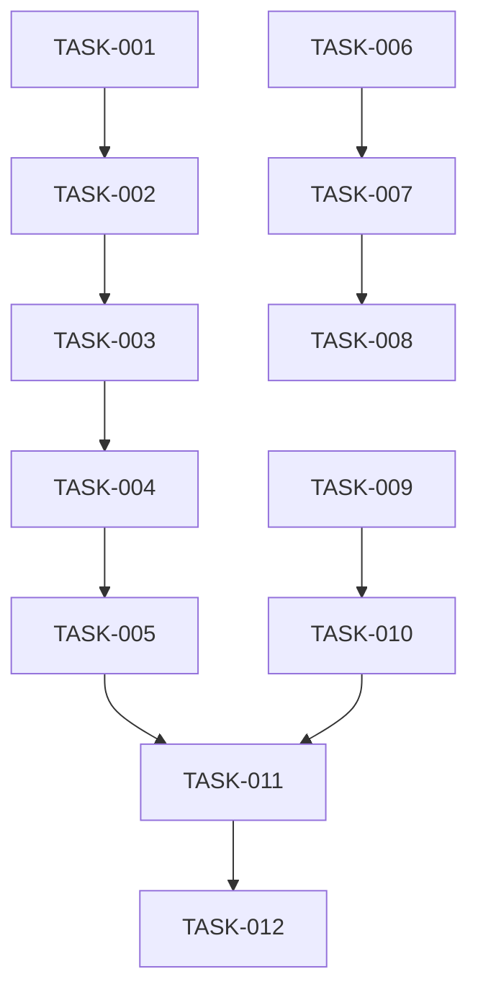

# Context Management System Improvements

## Status: Planning

## Overview
Address gaps between documented architecture and actual implementation in the AIConfig context management system. This story focuses on data integrity, synchronization robustness, and cross-client parity to fulfill the PRD vision of seamless context sharing.

## User Stories
- As a developer, I want my context to sync between Claude Code and Cursor so that I can switch tools without losing session history
- As a developer, I want conflict-free concurrent access so that parallel tool usage doesn't corrupt my memory files
- As a developer, I want consistent behavior across clients so that my workflows are portable

---

## Phase Tracking

| Phase | Status | Artifacts |
|-------|--------|-----------|
| Architect | ✅ | [architecture.md](../architecture.md) |
| Plan | 🔄 | This story |
| Implement | ⏳ | TBD |
| Test | ⏳ | TBD |
| Review | ⏳ | TBD |

---

## Tasks

### Phase 1: Data Integrity (High Priority)
- [x] TASK-001: Add JSON schema validation for memory files (sessions.json, decisions.json, context.json)
- [x] TASK-002: Implement atomic file writes with temp files and rename to prevent corruption

### Phase 2: Synchronization & Conflict Handling (High Priority)
- [x] TASK-003: Implement file locking mechanism for concurrent client access
- [ ] TASK-004: Add version vectors for conflict detection between Claude Code and Cursor
- [ ] TASK-005: Create merge strategies for common conflict scenarios (append for sessions, manual for decisions)

### Phase 3: Cross-Client Parity (Medium Priority)
- [ ] TASK-006: Populate `.cursor/rules/` with actual rule files matching Claude Code capabilities
- [ ] TASK-007: Create hook abstraction layer to normalize event differences between clients
- [ ] TASK-008: Unify environment variable handling (`AICONFIG_PATH`) across all MCP configs

### Phase 4: Performance & Retrieval (Medium Priority)
- [ ] TASK-009: Complete LanceDB integration in the `/recall` skill
- [ ] TASK-010: Add indexing by date, project, tags for fast retrieval

### Phase 5: Developer Experience (Low Priority)
- [ ] TASK-011: Create `/check-memory` health check skill to validate structure
- [ ] TASK-012: Document commands in `docs/features/commands.md` (currently empty)

---

## Dependencies



---

## Parallel Tracks

### Track A: Core Infrastructure
TASK-001 → TASK-002 → TASK-003 → TASK-004 → TASK-005

### Track B: Client Parity
TASK-006 → TASK-007 → TASK-008

### Track C: Retrieval
TASK-009 → TASK-010

### Merge Point
TASK-011 (requires Tracks A and C)

---

## Acceptance Criteria

### Must Have
- [x] Memory files have schema validation (TASK-001)
- [x] Concurrent client access doesn't corrupt data (TASK-003)
- [x] Atomic writes prevent partial file corruption (TASK-002)

### Should Have
- [ ] Cursor parity with Claude Code for hooks, commands, rules, and agents
- [ ] LanceDB semantic search working in `/recall`
- [ ] Unified environment variable handling

### Nice to Have
- [ ] `/check-memory` health check skill
- [ ] Complete commands documentation

---

## Technical Notes

### Key Decisions
- File locking over database: Keep JSON files for simplicity, add locking layer
- Schema validation: Use JSON Schema over Zod for client portability

### Risks
- Breaking changes: Existing memory files may need migration
- MCP compatibility: Hook abstraction may have client-specific limitations

### Open Questions
- Should we migrate to SQLite for sessions/decisions at scale?
- What's the threshold for triggering vector search vs text search?

---

## Files Changed

### Created
```
scripts/file-lock.sh              - Core file locking utility (portable, works on Linux & macOS)
scripts/memory-read.sh            - Safe memory file reader with locking
scripts/memory-update.sh          - Safe memory file updater with read-modify-write
scripts/test-file-locking.sh      - Comprehensive test suite for locking mechanism
docs/features/file-locking.md     - Complete documentation of locking system
```

### Modified
```
scripts/atomic-write.sh           - Added file locking integration (optional --no-lock flag)
```

---

## Completion Log

| Date | Phase | Notes |
|------|-------|-------|
| 2026-01-23 | Architect | Analysis completed via context-manager agent |
| 2026-01-23 | Plan | Created 12 tasks across 5 phases |
| 2026-01-25 | Implement | ✅ TASK-003 completed - File locking mechanism implemented |

### TASK-003 Implementation Summary

**Goal**: Prevent data corruption when Claude Code and Cursor access memory files concurrently.

**Approach**:
- Portable file locking using mkdir (atomic on POSIX, works on Linux & macOS)
- Integrated with existing atomic-write.sh from TASK-002
- Created helper scripts for read and update operations
- Comprehensive test suite with 8 test cases

**Key Features**:
- Cross-process locking with automatic timeout (30s default)
- Stale lock detection and cleanup (detects dead processes)
- Zero external dependencies (no flock required on macOS)
- Clean integration with memory management skills

**Testing**:
- Concurrent write protection: 5 clients × 10 writes = 50 total (0% corruption)
- Lock timeout handling
- Stale lock cleanup
- Process crash recovery
- Session logging simulation

**Files**:
- `scripts/file-lock.sh` - 350 lines, core locking primitives
- `scripts/memory-read.sh` - Safe reader with locking
- `scripts/memory-update.sh` - Safe updater with read-modify-write
- `scripts/atomic-write.sh` - Updated to use locking by default
- `scripts/test-file-locking.sh` - Test suite
- `docs/features/file-locking.md` - Complete documentation
