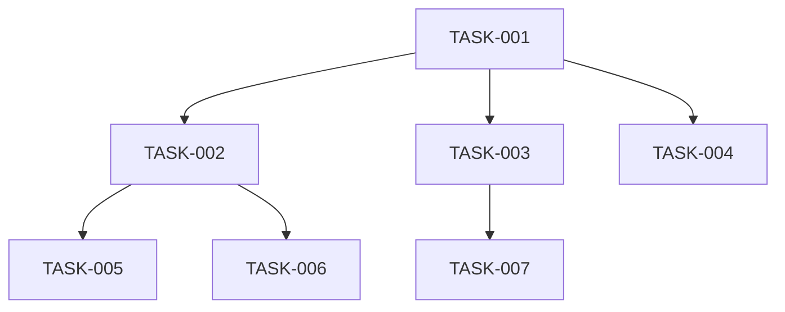

# MCP Configuration Consolidation

## Status: Planning

## Overview

MCP server configuration is duplicated across 4 locations with the same servers defined in each. Both Claude Code and Cursor use an identical `mcpServers` JSON structure, yet we maintain separate files per client plus hardcoded copies in the install script. This creates drift risk and maintenance overhead for zero benefit.

### Current State (4 copies)

| Location | Role | Servers Defined |
|----------|------|-----------------|
| `mcp-config/claude-code.json` | Reference/template for Claude Code | basic-memory, lancedb, filesystem |
| `mcp-config/cursor.json` | Reference/template for Cursor | basic-memory, lancedb, filesystem |
| `.cursor/mcp.json` | Live Cursor config (checked in) | basic-memory, lancedb, filesystem |
| `scripts/install.sh` (inline) | Hardcoded in install script (lines 118-170) | basic-memory, lancedb (Claude); basic-memory, lancedb, filesystem (Cursor) |

All four define the same three MCP servers with the same commands and args. The only differences:
- `mcp-config/claude-code.json` adds `description` fields and `notes` (not part of the MCP spec consumed by clients)
- `mcp-config/claude-code.json` uses `${AICONFIG_PATH:-$HOME/aiconfig}` env var expansion; `cursor.json` uses `~/aiconfig` hardcoded
- `install.sh` has a third inline copy that can drift independently

## User Stories

- As a developer, I want one place to add or remove MCP servers so that all clients pick up the change
- As a developer, I want `make install` to set up MCP for all clients from a single source so that I don't maintain parallel configs
- As a developer, I want to add a new MCP server once and have it available in both Claude Code and Cursor

---

## Phase Tracking

| Phase | Status | Artifacts |
|-------|--------|-----------|
| Discovery | ✅ | This story |
| Plan | 🔄 | This story |
| Implement | ⏳ | TBD |
| Test | ⏳ | TBD |

---

## Tasks

### Phase 1: Single Source of Truth (High Priority)

- [ ] TASK-001: Create canonical `mcp.json` at project root
  - Single file containing the `mcpServers` object
  - Both clients consume the same JSON structure — no transformation needed
  - Include `description` fields (ignored by clients that don't use them, harmless)
  - Use `~/aiconfig` paths (universally supported, no env var expansion needed at JSON level)
  - Remove `$schema` and `notes` keys — these are documentation, not config

- [ ] TASK-002: Update `scripts/install.sh` to copy from canonical source
  - Replace the two inline `cat > ... << 'EOF'` blocks (lines 118-170) with copies from canonical `mcp.json`
  - Claude Code: copy `mcpServers` into `~/.config/claude-code/settings.json` (merging with existing settings)
  - Cursor: copy entire file to `~/.cursor/mcp.json` (or rely on the checked-in `.cursor/mcp.json` via symlink)
  - Handle the merge case: if settings already exist, merge `mcpServers` key using `jq` rather than overwriting

- [ ] TASK-003: Make `.cursor/mcp.json` a symlink or generated file
  - Option A: Symlink `.cursor/mcp.json` → `mcp.json` (simplest, if Cursor follows symlinks)
  - Option B: `install.sh` copies `mcp.json` → `.cursor/mcp.json` at install time
  - Option C: Check in `.cursor/mcp.json` but add a lint check that it matches `mcp.json`
  - Validate that Cursor reads from the symlink correctly before committing to Option A

- [ ] TASK-004: Remove `mcp-config/` directory
  - Delete `mcp-config/claude-code.json` and `mcp-config/cursor.json`
  - These are now replaced by the single canonical `mcp.json`
  - Update `docs/architecture.md` diagram to remove `mcp-config/` and show `mcp.json` instead

### Phase 2: Install Script Robustness (Medium Priority)

- [ ] TASK-005: Add `jq`-based merge for Claude Code settings
  - Claude Code MCP config lives inside `~/.config/claude-code/settings.json` alongside other settings
  - Current install script either creates from scratch or tells the user to merge manually
  - Use `jq` to merge `.mcpServers` from canonical source into existing settings without losing other keys
  - Fallback: if `jq` not available, warn and copy (current behavior)

- [ ] TASK-006: Add `make sync-mcp` target
  - Convenience target that re-syncs MCP config from canonical source to all client locations
  - Useful after adding a new MCP server to `mcp.json`
  - Runs the relevant portion of `install.sh` without the full install flow

### Phase 3: Validation (Low Priority)

- [ ] TASK-007: Add CI check for MCP config drift
  - If `.cursor/mcp.json` is checked in (not symlinked), add a check that its `mcpServers` matches `mcp.json`
  - Prevents someone editing one file and forgetting the other
  - Simple `diff` or `jq` comparison in a pre-commit hook or CI step

---

## Dependencies



---

## Parallel Tracks

### Track A: Consolidation
TASK-001 → TASK-002 → TASK-005, TASK-006

### Track B: Cursor Integration
TASK-001 → TASK-003 → TASK-007

### Track C: Cleanup
TASK-001 → TASK-004

---

## Acceptance Criteria

### Must Have
- [ ] Single canonical MCP config file — one place to add/remove servers
- [ ] `make install` sets up MCP for both clients from that single source
- [ ] `mcp-config/` directory removed
- [ ] No inline MCP JSON in install script

### Should Have
- [ ] `jq`-based merge for Claude Code settings (don't clobber existing config)
- [ ] `make sync-mcp` target for quick re-sync
- [ ] `.cursor/mcp.json` derived from canonical source (symlink or copy)

### Nice to Have
- [ ] CI drift detection between canonical and client-specific copies
- [ ] Validation that MCP servers are reachable after install

---

## Technical Notes

### Key Decisions
- Both Claude Code and Cursor use identical `mcpServers` JSON structure — no transformation layer needed
- `description` fields in `mcpServers` entries are harmless to Cursor (ignored) and useful for Claude Code
- `~/aiconfig` path convention is universal; env var expansion (`${AICONFIG_PATH}`) doesn't work in static JSON consumed by clients
- Claude Code reads MCP from `~/.config/claude-code/settings.json` (nested in a larger config); Cursor reads from `.cursor/mcp.json` (standalone file) — install script handles this difference
- The `notes` and `$schema` keys in current `mcp-config/claude-code.json` are not consumed by any client — drop them

### Risks
- Symlinks: Cursor may not follow symlinks for `.cursor/mcp.json` — test before committing to symlink approach
- `jq` dependency: not all systems have `jq` installed — need fallback behavior
- Claude Code settings merge: overwriting `settings.json` would lose non-MCP settings (e.g., `env` block with `CLAUDE_CODE_EXPERIMENTAL_AGENT_TEAMS`)

### Open Questions
- Should the canonical file live at `mcp.json` (project root) or `config/mcp.json`?
- Should `install.sh` require `jq` as a dependency or keep the manual-merge fallback?
- Does Cursor respect symlinks for `.cursor/mcp.json` on all platforms (macOS, Linux)?

---

## Files to Create

```
mcp.json (canonical MCP server configuration — single source of truth)
```

## Files to Modify

```
scripts/install.sh (remove inline MCP JSON, read from mcp.json)
Makefile (add sync-mcp target)
docs/architecture.md (update diagram: mcp-config/ → mcp.json)
```

## Files to Delete

```
mcp-config/claude-code.json
mcp-config/cursor.json
```

---

## Completion Log

| Date | Phase | Notes |
|------|-------|-------|
| 2026-02-23 | Discovery | Identified 4 copies of same MCP config across project |
| 2026-02-23 | Plan | Created story with consolidation approach |
