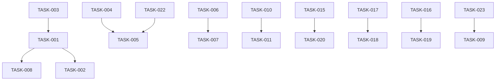

# User Journey Enablement

## Status: Planning

## Overview

Gaps identified by walking through the actual end-to-end user journey of using AIConfig with Cursor + Claude Code. The current system provides the primitives (memory, skills, context, handoff templates) but the user must manually orchestrate the workflow. This story covers automation and skills that bridge those gaps.

Discovered via: [How-To Example Walkthrough](../howto/example.md)

## User Stories

- As a developer, I want to start a feature with one command so that branch creation, memory update, and focus tracking happen together
- As a developer, I want to resume where I left off automatically so that I don't have to manually search for my last session
- As a developer, I want to hand off context between Cursor and Claude Code seamlessly so that neither tool loses track of what the other did
- As a developer, I want to check my current status so that I know what I'm working on, what branch I'm on, and what's left to do

---

## Phase Tracking

| Phase | Status | Artifacts |
|-------|--------|-----------|
| Discovery | ✅ | [example.md](../howto/example.md) |
| Plan | 🔄 | This story |
| Implement | ⏳ | TBD |
| Test | ⏳ | TBD |

---

## Tasks

### Phase 1: Feature Lifecycle Skills (High Priority)

- [ ] TASK-001: Create `/start-feature` skill
  - Creates feature branch following git conventions
  - Updates `context.json` with `current_focus`
  - Links to PRD if one was generated
  - Sets up the session for tracking
  - Works in both Claude Code and Cursor

- [ ] TASK-002: Create `/status` skill
  - Shows current branch, current focus from memory
  - Lists recent session activity
  - Shows outstanding TODOs/follow-ups from last session
  - Works in both Claude Code and Cursor

- [ ] TASK-003: Link `/generate-prd` output to project memory
  - After PRD generation, auto-update `context.json` current_focus
  - Store PRD reference in decisions.json as a planning decision
  - Surface the PRD via `/recall`

### Phase 2: Session Continuity (High Priority)

- [ ] TASK-004: Create `/resume` skill
  - Loads last session from `sessions.json`
  - Displays: what was accomplished, what's pending, current branch, follow-ups
  - Restores current_focus in context
  - Single command to get back up to speed

- [ ] TASK-005: Add session-start hook
  - On session start, auto-load project context if memory exists
  - Display a brief "welcome back" summary: last session date, current focus, pending items
  - Don't block — just surface context passively

### Phase 3: Cross-Client Handoff (Medium Priority)

- [ ] TASK-006: Create `/handoff` skill
  - Generates a structured handoff document from `templates/handoffs/`
  - Auto-fills from current session state (files changed, decisions, branch, focus)
  - Saves to memory so the receiving tool can pick it up via `/recall`
  - Replaces the manual log-then-recall pattern

- [ ] TASK-007: Add cross-client activity log
  - Track which client performed which actions (via version vectors)
  - Surface in `/status`: "Last activity: Claude Code modified auth.service.ts 10 min ago"
  - Helps when both tools are open simultaneously

### Phase 4: Workflow Automation (Medium Priority)

- [ ] TASK-008: Create `/finish-feature` skill
  - Runs final session log
  - Generates PR description from accumulated session logs
  - Updates memory to clear current_focus
  - Suggests next steps (merge, review, etc.)

- [ ] TASK-009: Auto-detect and surface coding standards
  - When starting work in a file type, proactively surface relevant standards
  - Example: opening a `.test.ts` file triggers testing standards context
  - Cursor rules partially do this — extend to Claude Code via hooks

### Phase 5: Observability (Low Priority)

- [ ] TASK-010: Create `/check-memory` health check skill
  - Validates memory file structure against schemas
  - Reports stale locks, conflicts, or corruption
  - Already noted in context-management-01 story — dedup if addressed there

- [ ] TASK-011: Session timeline view
  - Aggregate sessions across both clients into a chronological view
  - Show: date, client, focus area, key decisions
  - Useful for weekly reviews or onboarding a collaborator

### Phase 6: Format Compliance and Missed Capabilities (High Priority)

> Discovered by auditing against the actual [Cursor rules docs](https://cursor.com/docs/context/rules), [Cursor skills docs](https://cursor.com/docs/context/skills), [Claude Code skills docs](https://code.claude.com/docs/en/skills), [Claude Code hooks docs](https://code.claude.com/docs/en/hooks), [Claude Code memory docs](https://code.claude.com/docs/en/memory), and [Claude Code subagents docs](https://code.claude.com/docs/en/sub-agents).

#### Cursor Rules: Format Is Correct, Content Needs Work

**Note**: `.mdc` files in `.cursor/rules/` are a valid current format (both `.md` and `.mdc` are supported). It is `.cursorrules` (the root-level single file) that is deprecated. No format migration is needed.

**Note**: Cursor auto-discovers skills from `.claude/skills/`, `.cursor/skills/`, and `~/.claude/skills/`. Skills do NOT need to be duplicated into `.cursor/skills/`. However, `.cursor/skills/` currently has 3 redundant copies (`init-memory`, `log-session`, `recall`) that should be removed to avoid confusion.

- [ ] TASK-012: Remove redundant `.cursor/skills/` copies
  - Cursor auto-discovers `.claude/skills/` — duplicates in `.cursor/skills/` are unnecessary
  - Remove: `.cursor/skills/init-memory/`, `.cursor/skills/log-session/`, `.cursor/skills/recall/`
  - Verify skills still appear in Cursor after removal

- [ ] TASK-013: Audit Cursor rules for token budget awareness
  - `core-context.mdc` is `alwaysApply: true` — every chat pays this token cost
  - Rules that just reference context files (e.g., "see `context/coding-standards/typescript.md`") waste tokens without injecting the actual content
  - Consider: use `@path/to/file` imports in Cursor rules to inject real content, or convert to agent-decided (`alwaysApply: false` with good `description`)
  - Review which rules the AI actually uses vs ignores

- [ ] TASK-014: Evaluate using Cursor `AGENTS.md` integration
  - Cursor natively supports `AGENTS.md` in project root with hierarchical nesting
  - We have an `AGENTS.md` file — verify it's being loaded by Cursor
  - Consider whether `AGENTS.md` can replace some `.cursor/rules/` content for simpler maintenance

#### Claude Code: Skill Frontmatter Compliance

- [ ] TASK-015: Fix `/architect` skill — missing YAML frontmatter entirely
  - `architect/SKILL.md` has no `---` frontmatter markers
  - Claude cannot discover it via description matching — it's invisible to auto-invocation
  - Add `name`, `description`, and consider `context: fork` + `agent: Explore` for heavy analysis

- [ ] TASK-016: Add `disable-model-invocation: true` to side-effect skills
  - `/init-memory`, `/log-session`, `/generate-prd` all write files
  - Without this flag, Claude can auto-invoke these — risky for write operations
  - User should control when memory is initialized or sessions are logged
  - `/recall` is safe for auto-invocation (read-only)

- [ ] TASK-017: Remove "Triggers on:" noise from skill descriptions
  - Current descriptions include "Triggers on: init memory, setup memory..."
  - This is not how Claude uses descriptions — it matches semantically, not by keyword list
  - Rewrite descriptions as clear capability statements
  - Example: `"Initialize project memory structure with context, session, and decision tracking"`

- [ ] TASK-018: Add `$ARGUMENTS` support to skills that accept input
  - `/recall` should accept `$ARGUMENTS` as the search query
  - `/generate-prd` should accept `$ARGUMENTS` as the feature description
  - `/log-session` could accept `$ARGUMENTS` as a summary hint
  - Add `argument-hint` frontmatter for autocomplete (e.g., `argument-hint: "[search query]"`)

- [ ] TASK-019: Add `allowed-tools` restrictions to read-only skills
  - `/recall` should be restricted to `Read, Grep, Glob` — no write access
  - `/status` (new) should be restricted similarly
  - Prevents accidental side effects during information gathering

- [ ] TASK-020: Add `context: fork` to heavy-compute skills
  - `/architect` does deep analysis — should run in subagent to avoid polluting main context
  - `/recall` could benefit from `context: fork` + `agent: Explore` for large memory searches
  - Use `agent: Explore` for read-only forked skills, `agent: general-purpose` for write skills

- [ ] TASK-021: Use `!command` dynamic context injection where useful
  - `/status` skill should pre-fetch: `!git branch --show-current`, `!git status --short`
  - `/resume` skill should pre-fetch last session date from memory
  - Reduces round-trips — Claude gets data before starting its work

#### Claude Code: Hooks Must Be JSON (Not Markdown)

- [ ] TASK-022: Implement hooks as JSON in `.claude/settings.json`
  - Claude Code hooks are **JSON-configured in settings.json**, not markdown files
  - The existing `.claude/hooks/session-end.md` is not a valid hook — it's a skill or documentation
  - Supported events: `SessionStart`, `SessionEnd`, `PreToolUse`, `PostToolUse`, `UserPromptSubmit`, `Notification`, `Stop`, `SubagentStop`, plus newer events: `PreCompact`, `ConfigChange`, `WorktreeCreate`, `TeammateIdle`, `TaskCompleted`
  - Session-start hook (TASK-005) must use `SessionStart` event in settings.json with a command script
  - Hooks support three types: `command` (shell script), `prompt` (LLM evaluation), `agent` (subagent verification)
  - `SessionStart` hooks can inject `additionalContext` and persist env vars via `CLAUDE_ENV_FILE`

#### Claude Code: Use `.claude/rules/` for Conditional Context

- [ ] TASK-023: Adopt `.claude/rules/*.md` for path-specific coding standards
  - Claude Code now supports `.claude/rules/` with `paths` frontmatter for conditional loading
  - Currently all context lives in `context/` directory — not auto-loaded, only referenced
  - Move key standards into `.claude/rules/` so they auto-load when working with matching files:
    - `typescript.md` with `paths: ["**/*.ts", "**/*.tsx"]`
    - `testing.md` with `paths: ["**/*.test.*", "**/*.spec.*"]`
  - This replaces TASK-009 approach — use native rules instead of hooks

#### Claude Code: Use `@import` Syntax in CLAUDE.md

- [ ] TASK-024: Use `@path/to/import` in CLAUDE.md to inject context files
  - CLAUDE.md supports `@path/to/import` syntax to pull in other files (up to 5 levels deep)
  - Current CLAUDE.md references `context/` directory but doesn't import the files
  - Add imports like `@context/coding-standards/typescript.md` to inject content directly
  - Supports relative and absolute paths, resolves relative to the file containing the import

---

## Dependencies



---

## Parallel Tracks

### Track A: Feature Lifecycle
TASK-003 → TASK-001 → TASK-002 → TASK-008

### Track B: Session Continuity
TASK-004 → TASK-005

### Track C: Cross-Client
TASK-006 → TASK-007

### Track D: Observability
TASK-010 → TASK-011

### Track E: Cursor Cleanup (can start immediately)
TASK-012 (remove duplicates), TASK-013 (token audit), TASK-014 (AGENTS.md)

### Track F: Claude Code Skill Fixes (can start immediately)
TASK-015 → TASK-020
TASK-016 → TASK-019
TASK-017 → TASK-018

### Track G: Hook + Rules Infrastructure (can start immediately)
TASK-022 → TASK-005
TASK-023 (replaces TASK-009 approach)
TASK-024 (CLAUDE.md imports)

---

## Acceptance Criteria

### Must Have
- [ ] One-command feature start with branch + memory update
- [ ] One-command resume that shows where you left off
- [ ] Status command that answers "what am I working on?"
- [ ] All Claude Code skills have valid YAML frontmatter
- [ ] Side-effect skills gated with `disable-model-invocation: true`
- [ ] Hooks implemented as JSON in `.claude/settings.json` (not markdown)
- [ ] Redundant `.cursor/skills/` copies removed

### Should Have
- [ ] Automated handoff between tools
- [ ] PRD linked to memory automatically
- [ ] Feature finish with PR description generation
- [ ] Skills use `$ARGUMENTS` for input
- [ ] Read-only skills restricted with `allowed-tools`
- [ ] `.claude/rules/` adopted for conditional coding standards
- [ ] CLAUDE.md uses `@import` to inject context files

### Nice to Have
- [ ] Cross-client activity visibility
- [ ] Session timeline view
- [ ] `context: fork` for heavy-compute skills
- [ ] Dynamic context injection via `!command`
- [ ] Cursor `AGENTS.md` integration evaluated

---

## Technical Notes

### Key Decisions
- Skills in `.claude/skills/` are auto-discovered by both Claude Code and Cursor — no duplication needed
- `.mdc` is a valid current Cursor rules format (it's `.cursorrules` root file that's deprecated)
- Claude Code hooks are JSON in `settings.json`, not markdown files
- Claude Code `.claude/rules/` supports `paths` frontmatter — use for conditional coding standards
- CLAUDE.md `@import` syntax can inject context files directly
- Side-effect skills (`init-memory`, `log-session`, `generate-prd`) must be user-invocable only
- Memory writes must use existing atomic-write and file-lock scripts
- `SessionStart` hooks can inject `additionalContext` and persist env vars via `CLAUDE_ENV_FILE`

### Risks
- SessionStart hooks run on every session — keep scripts fast
- Cross-client activity tracking adds write overhead to every operation
- `/handoff` skill needs to handle the case where memory doesn't exist yet
- `context: fork` skills lose conversation history — only use for self-contained tasks
- Token budget: too many always-apply rules silently eat context
- `@import` in CLAUDE.md loads files into every session — be selective about what to import

### Open Questions
- Should `/start-feature` create a GitHub issue automatically?
- Should `/resume` work across projects (show all active projects)?
- How verbose should the session-start hook be?
- Should Cursor rules be `alwaysApply` or agent-decided? Token cost vs reliability tradeoff
- Should `/architect` use `context: fork` with `agent: Plan` or custom agent?
- Should `.claude/rules/` replace or supplement the `context/` directory approach?

---

## Files to Create

```
# New skills (auto-discovered by both Claude Code and Cursor)
.claude/skills/start-feature/SKILL.md
.claude/skills/status/SKILL.md
.claude/skills/resume/SKILL.md
.claude/skills/handoff/SKILL.md
.claude/skills/finish-feature/SKILL.md
.claude/skills/check-memory/SKILL.md

# Conditional coding standards (Claude Code .claude/rules/)
.claude/rules/typescript.md (with paths: ["**/*.ts", "**/*.tsx"])
.claude/rules/testing.md (with paths: ["**/*.test.*", "**/*.spec.*"])

# Hook scripts
.claude/hooks/session-start.sh (SessionStart command handler)
```

## Files to Modify

```
# Skill frontmatter fixes
.claude/skills/architect/SKILL.md (add frontmatter)
.claude/skills/init-memory/SKILL.md (add disable-model-invocation, rewrite description)
.claude/skills/log-session/SKILL.md (add disable-model-invocation, rewrite description)
.claude/skills/generate-prd/SKILL.md (add disable-model-invocation, add $ARGUMENTS)
.claude/skills/recall/SKILL.md (add allowed-tools, add $ARGUMENTS, rewrite description)

# Hook configuration
.claude/settings.json (add SessionStart hook as JSON config)

# CLAUDE.md imports
CLAUDE.md (add @import for key context files)

# Documentation updates
context/workflows/feature-development.md (reference new skills)
docs/howto/example.md (update gaps section as tasks complete)
```

## Files to Delete

```
# Redundant Cursor skills (Cursor auto-discovers .claude/skills/)
.cursor/skills/init-memory/
.cursor/skills/log-session/
.cursor/skills/recall/
```

---

## Completion Log

| Date | Phase | Notes |
|------|-------|-------|
| 2026-02-22 | Discovery | Gaps identified via end-to-end user journey walkthrough |
| 2026-02-22 | Plan | Created 11 tasks across 5 phases |
| 2026-02-22 | Audit | Added tasks from Cursor/Claude Code docs audit (initial pass, search-based) |
| 2026-02-22 | Audit v2 | Corrected against actual docs — removed wrong Cursor migration tasks, fixed skill parity (Cursor auto-discovers .claude/skills/), added .claude/rules/ and @import tasks (TASK-023, TASK-024), rewrote hook task (TASK-022) |
