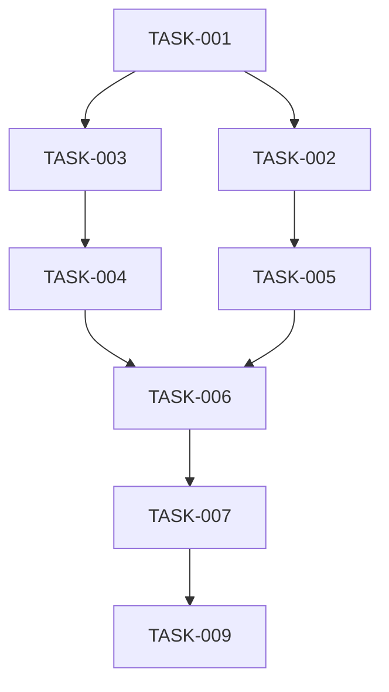

# [Feature Name]

## Status: [Planning | In Progress | Testing | Review | Complete]

## Overview
[2-3 sentence description of the feature]

## User Stories
- As a [user type], I want to [action] so that [benefit]
- As a [user type], I want to [action] so that [benefit]

---

## Phase Tracking

| Phase | Status | Artifacts |
|-------|--------|-----------|
| Architect | ⏳/🔄/✅ | [architecture.md](./architecture.md) |
| Plan | ⏳/🔄/✅ | [tasks/](./tasks/) |
| Implement | ⏳/🔄/✅ | [files list] |
| Test | ⏳/🔄/✅ | [test files] |
| Review | ⏳/🔄/✅ | [review report] |

---

## Tasks

### Phase 1: Database & Schema
- [ ] TASK-001: [description]
- [ ] TASK-002: [description]

### Phase 2: Backend Services
- [ ] TASK-003: [description]
- [ ] TASK-004: [description]

### Phase 3: Shared Components
- [ ] TASK-005: [description]

### Phase 4: Web Implementation
- [ ] TASK-006: [description]
- [ ] TASK-007: [description]

### Phase 5: Mobile Implementation
- [ ] TASK-008: [description] *(if applicable)*

### Phase 6: Testing
- [ ] TASK-009: [description]

---

## Dependencies



---

## Parallel Tracks

### Track A: Backend
TASK-001 → TASK-003 → TASK-004

### Track B: Frontend
TASK-002 → TASK-005

### Merge Point
TASK-006 (requires both tracks)

---

## Acceptance Criteria

### Must Have
- [ ] [Critical requirement 1]
- [ ] [Critical requirement 2]
- [ ] [Critical requirement 3]

### Should Have
- [ ] [Important requirement 1]
- [ ] [Important requirement 2]

### Nice to Have
- [ ] [Optional enhancement 1]

---

## Technical Notes

### Key Decisions
- [Decision 1]: [rationale]
- [Decision 2]: [rationale]

### Risks
- [Risk 1]: [mitigation]

### Open Questions
- [Question 1]

---

## Files Changed

### Created
```
[list files as implemented]
```

### Modified
```
[list files as implemented]
```

---

## Completion Log

| Date | Phase | Notes |
|------|-------|-------|
| YYYY-MM-DD | Architect | Completed architecture design |
| YYYY-MM-DD | Plan | Created N tasks |
| YYYY-MM-DD | Implement | Completed all tasks |
| YYYY-MM-DD | Test | All tests passing |
| YYYY-MM-DD | Review | Approved for merge |
