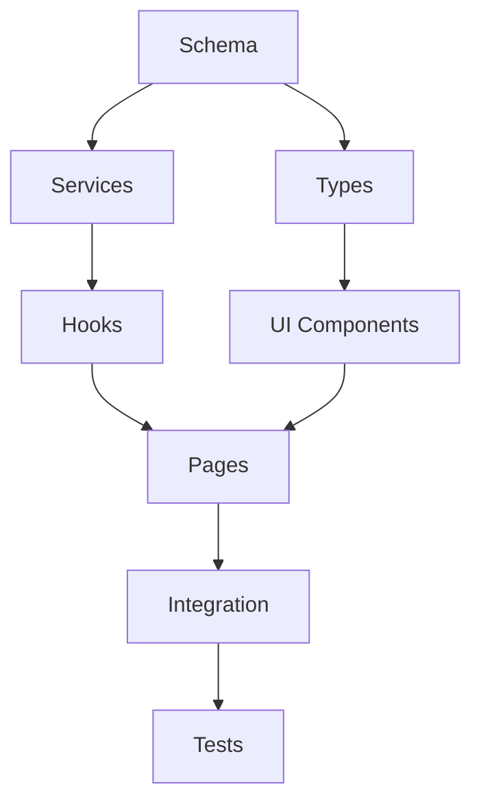

# Planning → Implementation Handoff

## Feature: [Feature Name]
## Date: [YYYY-MM-DD]
## Planner: Claude

---

## 1. Task Summary

| Metric | Value |
|--------|-------|
| Total Tasks | [N] |
| Estimated Complexity | [Small/Medium/Large] |
| Parallel Tracks | [N] |
| Critical Path Length | [N tasks] |

---

## 2. Task Breakdown

### Phase 1: Database & Schema
| ID | Task | Complexity | Dependencies |
|----|------|------------|--------------|
| TASK-001 | [description] | S/M/L | None |
| TASK-002 | [description] | S/M/L | TASK-001 |

### Phase 2: Backend Services
| ID | Task | Complexity | Dependencies |
|----|------|------------|--------------|
| TASK-003 | [description] | S/M/L | TASK-001 |
| TASK-004 | [description] | S/M/L | TASK-003 |

### Phase 3: Shared Components
| ID | Task | Complexity | Dependencies |
|----|------|------------|--------------|
| TASK-005 | [description] | S/M/L | TASK-002 |

### Phase 4: Web Implementation
| ID | Task | Complexity | Dependencies |
|----|------|------------|--------------|
| TASK-006 | [description] | S/M/L | TASK-004, TASK-005 |
| TASK-007 | [description] | S/M/L | TASK-006 |

### Phase 5: Testing
| ID | Task | Complexity | Dependencies |
|----|------|------------|--------------|
| TASK-008 | [description] | S/M/L | TASK-007 |

---

## 3. Dependency Graph



---

## 4. Parallel Execution Strategy

### Track A: Backend
Execute in order: TASK-001 → TASK-003 → TASK-004

### Track B: Frontend (after TASK-002)
Execute in order: TASK-005 → TASK-006 → TASK-007

### Merge Point
Both tracks must complete before: TASK-008

---

## 5. Critical Path

The longest dependency chain:
```
TASK-001 → TASK-003 → TASK-004 → TASK-006 → TASK-007 → TASK-008
```

This determines minimum implementation time.

---

## 6. Task File Locations

```
docs/features/[feature]/
├── feature.md           # Master document
└── tasks/
    ├── TASK-001.md
    ├── TASK-002.md
    ├── TASK-003.md
    ├── TASK-004.md
    ├── TASK-005.md
    ├── TASK-006.md
    ├── TASK-007.md
    └── TASK-008.md
```

---

## 7. Implementation Order

Execute tasks in this order for optimal flow:

1. **Start**: TASK-001 (Schema)
2. **Then parallel**:
   - Track A: TASK-003 (Services)
   - Track B: TASK-002 (Types)
3. **Continue parallel**:
   - Track A: TASK-004 (Hooks)
   - Track B: TASK-005 (Components)
4. **Merge**: TASK-006 (Pages)
5. **Continue**: TASK-007 (Integration)
6. **Finally**: TASK-008 (Tests)

---

## 8. Key Acceptance Criteria

### Must Have
- [ ] All CRUD operations working
- [ ] Proper error handling
- [ ] Type-safe throughout
- [ ] RLS policies enforced

### Should Have
- [ ] Loading states
- [ ] Empty states
- [ ] Optimistic updates

### Nice to Have
- [ ] Animations
- [ ] Advanced caching

---

## 9. Handoff Checklist

- [ ] All tasks documented in `docs/features/[feature]/tasks/`
- [ ] Master feature doc updated
- [ ] Dependencies clearly marked
- [ ] Acceptance criteria on each task
- [ ] Complexity estimated

---

## 10. Ready for Implementation

**Status**: ✅ Ready / ⚠️ Blocked

**Blockers** (if any):
- [blocker description]

**Notes for Developer**:
- Start with TASK-001
- Follow dependency order
- Commit after each task
- Run lint/build frequently
